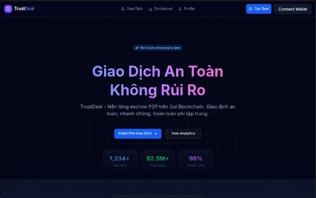
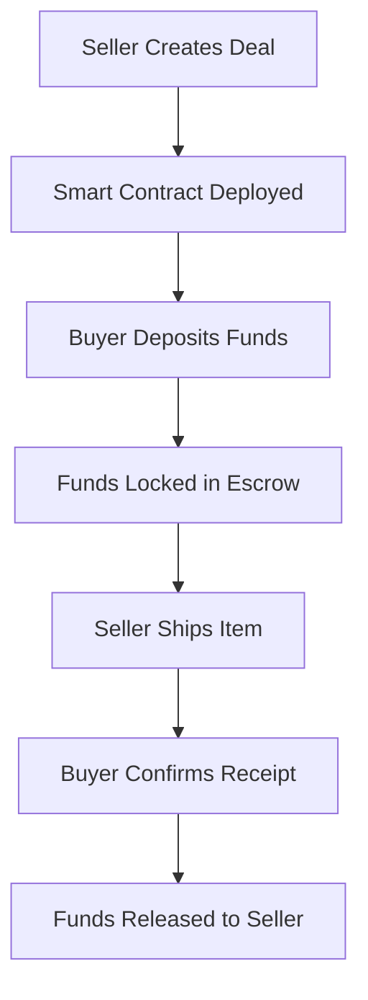

# 🤝 TrustDeal - Decentralized Escrow Platform

> 🏆 **Top 1 - SuiHub Discovery Mini-Hackathon** | Solo-built

> **The Future of Secure P2P Transactions on Sui Blockchain**

[](https://opensource.org/licenses/MIT)
[](https://sui.io)
[](https://nextjs.org)
[](https://www.typescriptlang.org/)
[](https://tailwindcss.com)

🚀 **Live Demo**: [Try TrustDeal](https://trust-deal.vercel.app)

---

## 🎯 Overview

**TrustDeal** is a production-ready decentralized escrow platform built on **Sui Blockchain** that eliminates the need for intermediaries in P2P transactions. Users can securely buy and sell with automatic fund protection using Move smart contracts.

### 🎥 Screenshot

<p align="center">
  
</p>

### Problem & Solution

**Problem:** Traditional P2P transactions are risky - scams, chargebacks, trust issues.

**Solution:** TrustDeal uses blockchain escrow to automatically hold and release funds based on smart contract logic.

---

## 🌟 Why This Project Stands Out

| Aspect                   | Details                                              |
| ------------------------ | ---------------------------------------------------- |
| 🏆 **Achievement**       | Top 1 at SuiHub Discovery Mini-Hackathon             |
| 👨‍💻 **Solo Development**  | Full-stack built entirely by one developer           |
| 🔗 **Real Blockchain**   | Deployed on Sui Testnet with working smart contracts |
| 🚀 **Production-Ready**  | Live demo, responsive UI, complete user flows        |
| 📊 **Full-Stack Skills** | Move (Smart Contracts) + Next.js 16 + TypeScript     |
| 🎨 **Modern UI/UX**      | Shadcn UI, Tailwind CSS, animations & charts         |

---

## ✨ Key Features

### 🔐 Security & Trust

- **Smart Contract Escrow** - Funds automatically locked on Sui blockchain
- **On-Chain Verification** - All transactions transparent and immutable
- **Trust Scores** - User reputation based on deal history
- **No Intermediaries** - Direct P2P with blockchain guarantees

### ⚡ Performance & UX

- **Real-Time Dashboard** - Live analytics with Recharts visualizations
- **Responsive Design** - Mobile-first, works on all devices
- **Beautiful UI** - Shadcn UI + Tailwind CSS 4
- **Instant Feedback** - Confetti animations, toast notifications
- **Type-Safe** - Full TypeScript coverage

### 🛠️ Developer Experience

- **Next.js 16** - App Router, Server Components, Server Actions
- **Move Language** - Secure smart contracts on Sui
- **@mysten/dapp-kit** - Official Sui wallet integration
- **React Query** - Optimized data fetching with caching
- **Mobile Responsive** - Seamless experience on all devices

---

## 🛠 Tech Stack

### Frontend

| Technology         | Purpose                         |
| ------------------ | ------------------------------- |
| **Next.js 16**     | React framework with App Router |
| **React 19**       | UI library                      |
| **TypeScript**     | Type safety                     |
| **Tailwind CSS**   | Styling                         |
| **shadcn/ui**      | Component library               |
| **TanStack Query** | Server state management         |

### Blockchain

| Technology           | Purpose         |
| -------------------- | --------------- |
| **Sui Move**         | Smart contracts |
| **@mysten/dapp-kit** | Sui integration |
| **@mysten/sui**      | SDK             |

---

## 🚀 Quick Start

### Prerequisites

- ✅ **Node.js 18+** - [Download](https://nodejs.org)
- ✅ **npm or pnpm** - Package manager
- ✅ **Sui Wallet** - [Install extension](https://chromewebstore.google.com/detail/slush-%E2%80%94-a-sui-wallet/opcgpfmipidbgpenhmajoajpbobppdil)
- ✅ **Sui CLI** (optional) - For deploying contracts

### Installation (2 minutes)

```bash
# 1. Clone repository
git clone https://github.com/kiettt23/trust-deal.git
cd trust-deal/web

# 2. Install dependencies
npm install

# 3. Create environment file
cp .env.example .env.local

# 4. Run development server
npm run dev

# 🎉 Open http://localhost:3000
```

### Get Devnet SUI Tokens

```bash
# Option 1: Via CLI
sui client faucet

# Option 2: Via Discord
# Join Sui Discord → #devnet-faucet → !faucet <your-address>
```

### Deploy Smart Contract (Optional)

```bash
cd move

# Publish to devnet
sui client publish --gas-budget 100000000

# Copy Package ID from output:
# ✅ Published PackageID: 0x...
# Add to web/.env.local
```

### Configuration

The application now fetches **REAL blockchain data** from Sui devnet:

1. **Deploy Contract**: Publish the Move smart contract to get a Package ID
2. **Set Package ID**: Add `NEXT_PUBLIC_PACKAGE_ID` to `web/.env.local`
3. **Connect Wallet**: Use Slush Wallet or Suiet to interact
4. **View Real Data**: All deals, stats, and transactions are fetched from blockchain

**Note:** If no deals exist on-chain yet, the dashboard will show 0 stats until you create deals.

---

## 📁 Project Structure

```
trust-deal/
├── move/                          # Smart Contracts (Sui Move)
│   ├── sources/
│   │   └── escrow.move           # Main escrow logic
│   └── Move.toml
│
└── web/                           # Frontend (Next.js)
    ├── app/
    │   ├── page.tsx              # Homepage & Hero
    │   ├── deals/                # Browse deals page
    │   ├── dashboard/            # Analytics dashboard
    │   ├── profile/              # User profile
    │   ├── deal/[id]/            # Deal detail page
    │   └── actions/              # Server Actions
    │
    ├── components/
    │   ├── ui/                   # UI components
    │   ├── Dashboard.tsx         # Analytics dashboard
    │   ├── DealList.tsx          # Deal list view
    │   └── Navbar.tsx            # Navigation bar
    │
    ├── hooks/
    │   ├── useEscrow.ts          # Escrow functions
    │   ├── useAuth.ts            # Auth utilities
    │   └── useDealStats.ts       # Stats queries
    │
    └── lib/
        └── utils.ts              # Utility functions
```

---

## 🔄 How It Works

### User Flow



### State Machine

| Status        | Code | Description      | Actions Available               |
| ------------- | ---- | ---------------- | ------------------------------- |
| **Created**   | 0    | Deal initialized | Buyer: Deposit / Seller: Cancel |
| **Locked**    | 1    | Funds escrowed   | Buyer: Confirm Delivery         |
| **Completed** | 2    | Funds released   | None (final state)              |
| **Cancelled** | 3    | Deal cancelled   | None (final state)              |

### Smart Contract Functions

```move
// 1. Create Deal (Seller)
public entry fun create_deal(price: u64, ctx: &mut TxContext)

// 2. Deposit Funds (Buyer)
public entry fun deposit(deal: &mut Deal, payment: Coin<SUI>, ctx: &mut TxContext)

// 3. Confirm Delivery (Buyer)
public entry fun confirm_delivery(deal: &mut Deal, ctx: &mut TxContext)

// 4. Cancel Deal (Seller, only if STATUS_CREATED)
public entry fun cancel_deal(deal: &mut Deal, ctx: &mut TxContext)
```

---

## 📊 Features in Detail

### 1. Homepage

- Hero section with gradient animations
- Quick deal creation form
- Feature showcase
- Live statistics

### 2. Deals Page (`/deals`)

- Real-time deal listings from localStorage
- Search by ID or address
- Filter by status (Created, Locked, Completed, Cancelled)
- Sort by date or amount
- Responsive grid layout

### 3. Dashboard (`/dashboard`)

- Platform-wide statistics
- Interactive charts (Recharts):
  - Bar chart: 7-day transaction volume
  - Pie chart: Deal status distribution
  - Line chart: Daily activity
- Real blockchain data

### 4. Profile Page (`/profile`)

- Auto-detects wallet address
- User statistics (deals created, completed, trust score)
- Deal history
- Performance metrics with progress bars

### 5. Deal Detail (`/deal/[id]`)

- Live deal status
- Timeline visualization
- Action buttons (context-aware)
- Transaction history
- Copy deal ID/addresses

---

## 🗂️ Data Storage

### Current Implementation (Demo)

**LocalStorage-based**:

- Deal IDs stored in browser `localStorage`
- Persists across page refreshes
- Device-specific (not synced)

```javascript
// Deal IDs stored as:
localStorage.setItem(
  "deal_ids",
  JSON.stringify(["0xabc123...", "0xdef456..."])
);
```

### Production Recommendations

For production deployment, implement one of these:

1. **Sui Indexer API** (Recommended)

   ```typescript
   // Query all Deal objects globally
   const response = await indexer.getDynamicFields({
     parentId: REGISTRY_OBJECT_ID,
   });
   ```

2. **GraphQL Endpoint**

   ```graphql
   query AllDeals {
     objects(
       filter: { type: "${PACKAGE_ID}::escrow::Deal" }
     ) {
       edges { node { ... } }
     }
   }
   ```

3. **Backend + Database**
   - Index events via WebSocket
   - Store in PostgreSQL/MongoDB
   - Expose REST/GraphQL API

---

## 🚀 Deployment

### Deploy Frontend (Vercel)

```bash
cd web

# Install Vercel CLI
npm i -g vercel

# Deploy
vercel

# Add environment variables in Vercel dashboard
```

### Deploy to Other Platforms

**Netlify**:

```bash
netlify deploy --prod
```

**AWS Amplify**:

```bash
amplify publish
```

### Smart Contract Deployment

**Devnet**:

```bash
sui client publish --gas-budget 100000000
```

**Mainnet** (requires sufficient SUI):

```bash
sui client switch --env mainnet
sui client publish --gas-budget 100000000
```

---

## 🛣️ Roadmap

### ✅ Completed (v1.0)

- [x] Smart contract escrow logic
- [x] Next.js 16 frontend
- [x] Wallet integration
- [x] Real blockchain data
- [x] Responsive design
- [x] Dashboard analytics
- [x] Profile pages
- [x] Deal lifecycle management

### 🚧 In Progress (v1.1)

- [ ] Sui Indexer integration (remove localStorage)
- [ ] WebSocket for real-time updates
- [ ] Push notifications
- [ ] Advanced search & filters

### 🔮 Future (v2.0)

- [ ] Multi-signature deals
- [ ] Dispute resolution system
- [ ] Reputation NFTs
- [ ] Cross-chain bridges
- [ ] Mobile app (React Native)
- [ ] Mainnet deployment

---

## 📄 License

This project is licensed under the **MIT License** - see [LICENSE](./LICENSE) file.

---

## 🙏 Acknowledgments

- **Sui Foundation** - For the amazing blockchain platform
- **Mysten Labs** - For excellent developer tools
- **Shadcn** - For beautiful UI components
- **Vercel** - For seamless deployment

---

**Built with ❤️ by the kiettt23**

⭐ **Star this repo** if you find it useful!

---

**Last Updated**: January 13, 2026 | **Version**: 1.1.0
